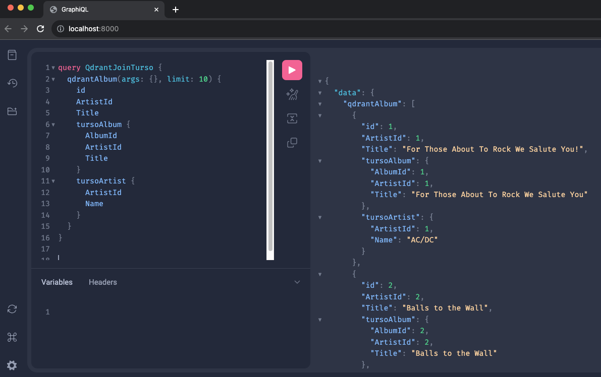

# Local Installation
Clone this

Fill out the .env with your details using .env.example as a template
(You should only need to provide a github PAT for defaults)

Run `docker compose up`

Navigate to `http://localhost:8000/` for GraphiQL via V3 engine

# Cloud Access

There is a supergraph project currently hosted [here](https://console.hasura.io/project/glad-sturgeon-9850/graphql). This project includes an additional Neon database in the default namespace. Work is being done to add that to the local demo. All the same queries will run in both. To demo console, use the cloud project. To demo speed use the local one. 

## Supergraph query

Let's see something exciting right off the bat. Not only will we query multiple data sources in a single query, but
we're also going to use a federated schema to do it. This means that we can query across multiple subgraphs, each of
which exposes a subset of the overall schema. This is a powerful concept that allows us to build a single schema that
represents our entire data model, but we can break it up into smaller pieces that are easier to manage and maintain.

Below, we're going to query across two different data sources: Turso, and Qdrant. Each of these data sources
is represented by a subgraph, and can be owned by different teams.

```graphql
query SuperGraph {
  tursoArtist(limit: 5, where: { _or: [{ ArtistId: { _lt: 3 } }, { ArtistId: { _gt: 7 } }] }) {
    Albums(limit: 5) {
      AlbumId
      Tracks(limit: 5, where: { Name: { _like: "%a%" } }) {
        TrackId
        Name
      }
    }
  }
  qdrantMultimodalRecipeById(id: 1) {
    id
    name
    steps
  }
  qdrantMultimodalRecipe(args: {}, limit: 10, where: { name: { like: "%squash%" } }) {
    id
    name
    score
  }
}
```

## Turso

Turso is build on top of SQLite with boasted microsecond latency.


### Features

- Edge-hosted
- Pagination
- Ordering
- Where filtering
  - AND
  - OR
  - NOT
  - LIKE
  - GLOB
  - \>
  - <
  - \>=
  - <=
  - ==
  - !=
- Variables
- Relationships

### Queries:

#### Example 1

```graphql
query TursoChinook {
  tursoAlbum(limit: 10, order_by: { AlbumId: Asc }, offset: 1) {
    AlbumId
    Title
    Tracks(limit: 3, order_by: { Name: Desc }) {
      TrackId
      Name
    }
  }
}
```

#### Example 2

```graphql
query AlbumsWithTracks {
  tursoAlbum(limit: 10, order_by: { Title: Asc }, where: { Title: { _glob: "*Love*" } }) {
    AlbumId
    Title
    Tracks(limit: 3, order_by: { Name: Asc }) {
      TrackId
      Name
    }
  }
}
```

## Qdrant

Qdrant is a vector search engine that allows you to search for similar vectors within embeddings.

### Features:

- Vector search with both positive and negative examples passed by ID
- Pagination
- Search scoring
- Vector search on pure vector of `Floats`
- Where filtering
  - AND
  - OR
  - NOT
  - LIKE
  - ==
  - !=
- Variables
- Remote Joins

### Queries

#### Example 1

```graphql
query RecipeRecommend($positive: [Int!] = [1]) {
  qdrantMultimodalRecipeById(id: 1) {
    id
    name
  }
  qdrantMultimodalRecipe(args: { recommend: {positive: $positive }}, limit: 10) {
    id
    name
  }
}
```

#### Example 2

```graphql
query AdvancedVectorSearch {
  positiveRecipe: qdrantMultimodalRecipeById(id: 2) {
    id
    name
  }
  negativeRecipe: qdrantMultimodalRecipeById(id: 3) {
    id
    name
  }
  qdrantMultimodalRecipe(args: { recommend: {positive: [2], negative: [3]}}, limit: 5) {
    id
    name
    score
  }
}
```


### Remote Join From Qdrant to Turso

```graphql
query QdrantJoinTurso {
  qdrantAlbum(args: {}, limit: 10) {
    id
    ArtistId
    Title
    tursoAlbum {
      AlbumId
      ArtistId
      Title
    }
    tursoArtist {
      ArtistId
      Name
    }
  }
}
```

Sub-50ms remote database joins with docker-compose.


## Typescript Function Connector

Functions:

```graphql
mutation functions {
  functionsFetchrandomdadjoke
  functionsDefineword(word: "peanut butter")
  functionsFetchcatfacts(limit: 2, max_length: 100, page: 1)
  functionsGeneraterange(start: 0, end: 3)
  functionsAddnumbers(a: 10, b: 5)
}
```

Example Output:

```json
{
  "data": {
    "functionsFetchrandomdadjoke": {
      "id": "usrcaMuszd",
      "joke": "What's the worst thing about ancient history class? The teachers tend to Babylon.",
      "status": 200
    },
    "functionsDefineword": "A spread made from ground peanuts.",
    "functionsFetchcatfacts": [
      {
        "fact": "Cats have 3 eyelids.",
        "length": 20
      },
      {
        "fact": "Cats walk on their toes.",
        "length": 24
      }
    ],
    "functionsGeneraterange": [
      0,
      1,
      2,
      3
    ],
    "functionsAddnumbers": 15
  }
}
```

## DuckDB

DuckDB is a high-performance, analytical database that is designed to be embedded in applications.

**You can use the DuckDB connector hosted here on Hasura DDN**:
[https://connector-e26f2620-54e3-439e-b9b1-95f873c71f50-hyc5v23h6a-ue.a.run.app](https://connector-e26f2620-54e3-439e-b9b1-95f873c71f50-hyc5v23h6a-ue.a.run.app)

### Features

- Limit
- Offset
- Ordering
- Where filtering
  - AND
  - OR
  - NOT
  - LIKE
  - GLOB
  - \>
  - <
  - \>=
  - <=
  - ==
  - !=
- Variables

### Queries

#### Example 1

```graphql
query HNDuckDB {
  duckdbSampleDataHnHackerNews(limit: 10) {
    id
    text
    time
  }
}
```

#### Example 2

```graphql
query FilteredHNNews {
  duckdbSampleDataHnHackerNews(
    limit: 10
    where: { _and: [{ title: { _like: "%tech%" } }, { _not: { text: { _like: "%apple%" } } }] }
  ) {
    id
    title
    text
    time
  }
}
```

#### Example 3

```graphql
query OrderedHNData($limitNum: Int = 5) {
  duckdbSampleDataHnHackerNews(limit: $limitNum, order_by: { time: Desc }) {
    id
    title
    text
    time
  }
}
```

# What containers are there?

### auth

`docker-compose.yaml`
```yaml
services:
  auth:
    ports:
      - "3050:3050"
    build: ./auth
```

The auth service is a dev service that passes through any requests, and if the role is missing it sets it to admin.

### engine
`docker-compose.yaml`
```yaml
services:
  engine:
    build:
      context: ./engine
      dockerfile: Dockerfile
      args:
        GITHUB_PAT: ${GITHUB_PAT}
    ports:
      - "8000:8000"
    volumes:
      - ${ENGINE_METADATA_PATH}:/engine_metadata.json
      - ${ENGINE_AUTH_PATH}:/auth_config.json
    environment:
      - HASURA_GRAPHQL_CORS_DOMAIN=http://localhost:3000
    command: ["cargo", "run", "--release", "--bin", "engine", "--", "--port", "8000", "--metadata-path", "/engine_metadata.json", "--authn-config-path", "/auth_config.json"]
    restart: always
    depends_on:
      - auth
```

The engine service clones the v3 engine using the provided github pat and runs it, passing the auth-config and the engine_metadata

Navigate to `http://localhost:8000/` for GraphiQL via V3 engine




### qdrant_database

`docker-compose.yaml`
```yaml
services:
  qdrant_database:
    image: qdrant/qdrant
    ports:
      - "6333:6333"
    restart: always
```

This runs the [qdrant](https://qdrant.tech/) database image on port `6333`.

When running you can navigate to `http://localhost:6333/dashboard` for Qdrant dashboard

The dashboard provides a firebase-esque experience for viewing your Qdrant database. 


You can also view the data-points that you have uploaded.


You can download/upload snapshots to Qdrant. The `snapshot-uploader` service utilizes this in order to download snapshots from a public S3 bucket (currently hosted in Europe) to load the database when started for the first time. Subsequent starts will use the cached snapshots to reset the database to it's initial/default state.


### snapshot-uploader

`docker-compose.yaml`
```yaml
services:
  snapshot-uploader:
    build:
      context: ./worker
      dockerfile: Dockerfile
    volumes:
      - snapshot-data:/app/snapshots
    depends_on:
      - qdrant_database
```

This downloads a series of snapshots from an S3 bucket and uploads it to Qdrant. For more details please see the `worker` directory.

### qdrant

`docker-compose.yaml`
```yaml
services:
  qdrant:
    build: ./connector-qdrant
    ports:
      - "8102:8102"
    volumes:
      - ${QDRANT_METADATA}:/etc/connector/config.json
```

This uses the Dockerfile located at `connector-qdrant/Dockerfile` to clone and run an instance of the [qdrant connector](https://github.com/hasura/ndc-qdrant).

Altering the `QDRANT_METADATA` variable in the `.env` file allows you to specify the location of the metadata file.

The Qdrant connector is hosted on: `http://localhost:8102`

You can use the LSP to generate the metadata for the Qdrant connector by creating a `.hml` file that contains:

`metadata.hml`
```yaml
kind: DataConnector
version: v1
definition:
  name: qdrant_connector
  url:
    singleUrl: http://localhost:8102
```
 
The Qdrant connector is hosted on: `https://connector-47629a21-7910-4def-ae48-9ea63f297ca4-hyc5v23h6a-ue.a.run.app` as well, and pointing the singleUrl at that will allow you to connect to the hosted instance instead of the local.

### turso

`docker-compose.yaml`
```yaml
services:
  turso:
    build: ./connector-turso
    ports:
      - "8101:8101"
    volumes:
      - ${TURSO_METADATA}:/etc/connector/config.json
      - ${TURSO_DATABASE}:/usr/src/app/database.sqlite
```

This uses the Dockerfile located at `connector-turso/Dockerfile` to clone and run an instance of the [turso connector](https://github.com/hasura/ndc-turso).

Altering the `TURSO_METADATA` variable in the `.env` file allows you to specify the location of the metadata file.

Altering the `TURSO_DATABASE` variable in the `.env` file allows you to specify a file so you can ship the database with the connector.

The Turso connector is hosted on: `http://localhost:8101`

You can use the LSP to generate the metadata for the Turso connector by creating a `.hml` file that contains:

`metadata.hml`
```yaml
kind: DataConnector
version: v1
definition:
  name: turso_connector
  url:
    singleUrl: http://localhost:8101
```

Then using Refresh + Track All via the VSCode extension
 
The Turso connector is hosted on: `https://connector-de77cc89-c674-4606-bfe6-443fb20caeeb-hyc5v23h6a-ue.a.run.app` as well, and pointing the singleUrl at that will allow you to connect to the hosted instance instead of the local.

### functions

`docker-compose.yaml`
```
services:
  functions:
    image: ghcr.io/hasura/ndc-typescript-deno:latest
    volumes:
      - ${FUNCTIONS_SRC}:/functions/src
    ports:
      - "8080:8080"
```

This uses the [typescript connector](https://github.com/hasura/ndc-sdk-typescript) to add functions onto the graph which can contain custom business logic.

Altering the `FUNCTIONS_SRC` variable in the `.env` file allows you to specify the location of the functions.

The functions connector is hosted on: `http://localhost:8080`

You can use the LSP to generate the metadata for the functions connector by creating a `.hml` file that contains:

`metadata.hml`
```yaml
kind: DataConnector
version: v1
definition:
  name: turso_connector
  url:
    singleUrl: http://localhost:8080
```

Then using Refresh + Track All via the VSCode extension

The Functions connector is hosted on: `https://connector-6606e963-47c8-4257-8563-ddb8119467be-hyc5v23h6a-ue.a.run.app` as well, and pointing the singleUrl at that will allow you to connect to the hosted instance instead of the local.

## Generating engine metadata

In the `ddn-metadata` directory you'll find a Hasura DDN metadata structure.

In order to run the engine locally, you will need to convert the YAML into a unified JSON object.

An example of the structure this object requires can be found in: `engine_metadata.json`

There is a useful helper script located at `generate_config.py` that can be run with python. `python3 generate_config.py`
This script will walk through each subgraph, and parse the `.hml` (via a `yaml` parser) collecting them as JSON objects.

Upon completion this script will overwrite the file at: `engine/metadata.json`

At the top of this script is a dictionary mapping the subgraph name to the localhost url. 

```python
SUBGRAPH_DOCKERS = {
    "turso": "http://turso:8101",
    "qdrant": "http://qdrant:8102",
    "functions": "http://functions:8080"
}
```

This can be (*optionally) used to redirect the cloud project to a locally hosted connector. The DuckDB connector is not hosted locally, but when running engine locally it just makes a remote call to the deployed duckdb connector. 